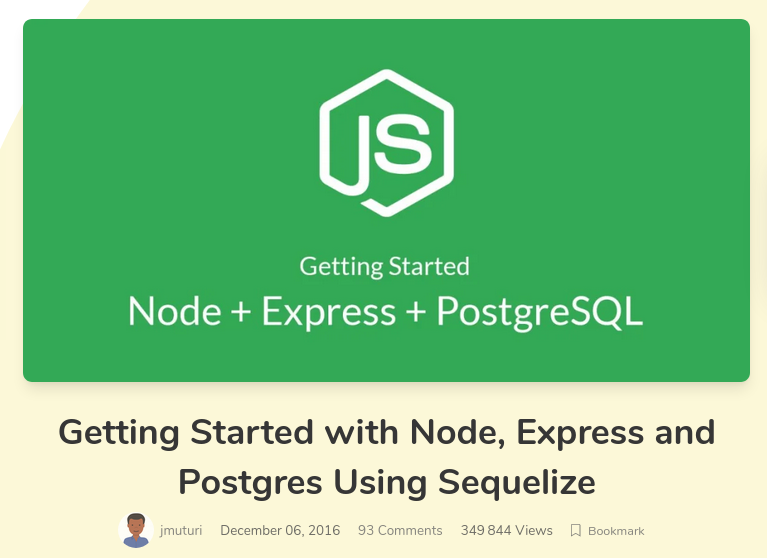
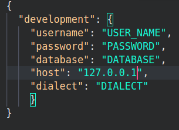
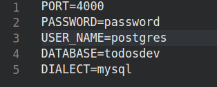
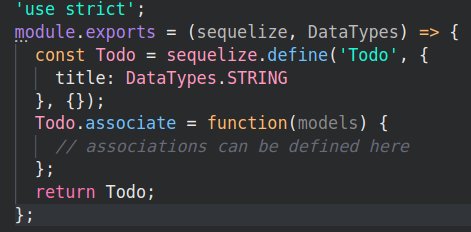

# TO DO LIST (Express, Babel, Sequelize, SQL) 


1. Installer **EXPRESS GENERATOR** : 
> **npm install -g express-generator**

> **express --view=pug newtodo**

Entrer dans le dossier : **cd newtodo**

Refactoriser les variables du dossier _**routes**_ et les fichiers **index** et **user** sur VScode, idem pour le fichier **bin**changer toutes les variables (_**sur vs code faire ctrl+f, taper var + cliquer sur l’édredon en haut à gauche et remplacer par const**_)

2. Installer **BABEL** : 
> **npm install @babel/core @babel/node --save-dev**

Ouvrir dans VS code _**package.json**_, changer la ligne start par: 
> **"start":"nodemon --exec babel-node ./bin/www"**

Installation des _**presets**_ de base de Babel : 
> **npm install @babel/preset-env --save-dev**

Création du fichier de configuration pour Babel : **touch .babelrc**

3. Refactoriser les imports : Ouvrir avec VS code babelrc : **code .babelrc** puis copier dans le fichier  (récupération sur mon repo dans le fichier .babelrc): 

```

{
    "presets": [
      "@babel/preset-env"
    ]
  }


```


Dans VS code ajouter le code suivant (récupération dans le repo dans le fichier app.js) (prendre uniquement les variables et imports):

```

import createError from "http-errors";
import express from "express";
import path from "path";
import cookieParser from "cookie-parser";
import logger from "morgan";
require("dotenv-extended").load();

import indexRouter from "./routes/index";
import usersRouter from "./routes/users";

const app = express();

```


4. Installation du système de variables d'environnement : 
> **npm install dotenv-extended --save**

a. Création du fichier **.env**: **touch .env**

b. Création de la première variable d'environnement dans le fichier .env : **PORT=4000** 
(_En gros, cette étape sert à isoler des variables_)

c. Test d'import + test du fonctionnement de **dotenv** 
puis aller sur le terminal et démarrer l’interface : **npm start** 

_**Remarque**_ _: si, cette manipulation crash faire un npm install, puis refaire un npm start.
Si le port ne fonctionne pas aller sur le terminal pour reset en faisant : rs puis relancer sur firefox et mettre **localhost:4000**_

5. Ajout du template Bootstrap dans les _**pugs views**_ : 
**Aller dans le fichier views**

- Copier le contenu du fichier index.pug puis coller sur vs code dans le fichier **views > index.pg** (remplacer celui-ci par le contenu déjà existant) 

- Copier le contenu du fichier layout.pug puis coller sur vs code dans le fichier **views > layout.pg** (remplacer celui-ci par le contenu déjà existant) 


Aller sur le site https://scotch.io/tutorials/getting-started-with-node-express-and-postgres-using-sequelize



6. Aller directement à l’étape **Sequilize Setup** : 
Dans le terminal : 
> **npm install -g sequelize-cli**
dans VS code sur le fichier **.sequilizerc** ajouter ceci : 

```
const path = require('path');

module.exports = {
  "config": path.resolve('./server/config', 'config.json'),
  "models-path": path.resolve('./server/models'),
  "seeders-path": path.resolve('./server/seeders'),
  "migrations-path": path.resolve('./server/migrations')
};

```


Dans le terminal à nouveau : 

> **npm install --save sequelize pg pg-hstore**
> **sequelize init**

7. Création de la base de données : 
> **CREATE DATABASE todosdev;** ⇐ pour créer une nouvelle base de données sur Psql 
Dans VScode, modifier dans server> config> config.json 
ajouter ceci : 




sur le doc **.env** ajouter : 



Dans le terminal : 
> **sequelize model:create --name Todo --attributes title:string**
Vérifier que dans VS code le fichier qu’un fichier à été créé dans **migrations** et dans **models** (todo.js)

Dans le terminal : 
> **sequelize model:create --name TodoItem --attributes content:string,complete:boolean**

⇒ vérifier qu’un nouveau fichier apparait dans create to do items dans **migrations**
⇒ vérifier qu’un nouveau fichier apparait dans todoitems.js dans **models**

Dans le dossier **server/models/todo.js** : 
Modifier :



Par 

```
module.exports = (sequelize, DataTypes) => {
  const Todo = sequelize.define('Todo', {
    title: {
      type: DataTypes.STRING,
      allowNull: false,
    },
  });

  Todo.associate = (models) => {
    Todo.hasMany(models.TodoItem, {
      foreignKey: 'todoId',
      as: 'todoItems',
    });
  };

  return Todo;
};

```

Dans le dossier **server/models/todoitem.js** supprimer le contenu et remplacer par : 
_Remarque : Ne pas supprimer le **‘use strict’;**_

```
module.exports = (sequelize, DataTypes) => {
  const TodoItem = sequelize.define('TodoItem', {
    content: {
      type: DataTypes.STRING,
      allowNull: false,
    },
    complete: {
      type: DataTypes.BOOLEAN,
      defaultValue: false,
    },
  });

  TodoItem.associate = (models) => {
    TodoItem.belongsTo(models.Todo, {
      foreignKey: 'todoId',
      onDelete: 'CASCADE',
    });
  };

  return TodoItem;
};

```

Dans le dossier **server/migrations/<date>-create-todo.js**, changer le contenu et remplacer par :
_Remarque : ne pas supprimer **‘use strict’;**_

```
module.exports = {
  up: (queryInterface, Sequelize) =>
    queryInterface.createTable('Todos', {
      id: {
        allowNull: false,
        autoIncrement: true,
        primaryKey: true,
        type: Sequelize.INTEGER,
      },
      title: {
        type: Sequelize.STRING,
        allowNull: false,
      },
      createdAt: {
        allowNull: false,
        type: Sequelize.DATE,
      },
      updatedAt: {
        allowNull: false,
        type: Sequelize.DATE,
      },
    }),
  down: (queryInterface /* , Sequelize */) => queryInterface.dropTable('Todos'),
};

```


Dans le dossier **server/migrations/<date>-create-todo-item.js**, changer le contenu et remplacer par :
_Remarque : ne pas supprimer **‘use strict’;**_

```
module.exports = {
  up: (queryInterface, Sequelize) =>
    queryInterface.createTable('TodoItems', {
      id: {
        allowNull: false,
        autoIncrement: true,
        primaryKey: true,
        type: Sequelize.INTEGER,
      },
      content: {
        type: Sequelize.STRING,
        allowNull: false,
      },
      complete: {
        type: Sequelize.BOOLEAN,
        defaultValue: false,
      },
      createdAt: {
        allowNull: false,
        type: Sequelize.DATE,
      },
      updatedAt: {
        allowNull: false,
        type: Sequelize.DATE,
      },
      todoId: {
        type: Sequelize.INTEGER,
        onDelete: 'CASCADE',
        references: {
          model: 'Todos',
          key: 'id',
          as: 'todoId',
        },
      },
    }),
  down: (queryInterface /* , Sequelize */) =>
    queryInterface.dropTable('TodoItems'),
};
```
Une fosi ces étapes terminées faire : 
> **sequelize db:migrate**

8. Création des controller et Routing
Dans le terminal VS code, créer le fichier _**controllers**_ à l’intérieur le fichier de **todos.js**, à l’intérieur ajouter : 
**‘use strict’;**


